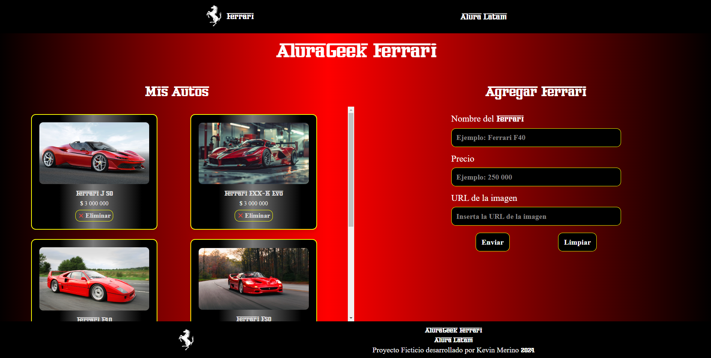

<div align="center"></div>
<div align="center"></div>

# 🏎️🏁 AluraGeek Ferrari

<div align="center"></div>
<div align="center">
    
    
    
</div>

## 💡 Descripción y Funcionalidades

- Proyecto que permite insertar tarjetas por medio del formulario **_Agregar Ferrari_**, que posteriormente se agregan a la sección **_Mis Autos_**.

- Cuando se abre la página, aparecerá el logo de Ferrari parpadeando durante 1.5 segundos, simulando un "loader" que desaparece cuando los datos de la página están cargados por completo.

- Cada tarjeta contiene la imagen, el modelo y el precio del **_Ferrari_**.

- Puedes eliminar la tarjeta con el botón **_Eliminar_**.

- El título de la sección que contiene las tarjetas de los carros cambiará en función de lo siguiente:

  - Si JSON Server no está ejecutandose, el título mostrará "Error de conexión"
  - Si el archivo db.json está vacio, el título mostrará "No hay autos para mostrar"
  - Si db.json tiene registros guardados, el título mostrará "Mis Autos"

- Si intentas enviar una nueva tarjeta sin que JSON Server esté corriendo, la página mostrará un alert diciendo "Error al tratar de enviar la tarjeta"

- El proyecto es capaz de adaptarse a diferentes tamaños de pantalla.

- AluraGeek es un desafío de **Oracle + Alura Latam** del programa **Front End G7** que pone a prueba nuestros conocimientos de programación asíncrona y manejo del DOM con eventos en **_JavaScript_** y el conocimiento adquirido en las tecnologías **_HTML_** y **_CSS_**.

- AluraGeek utiliza **_JSON Server_** para la simulación del Back End del proyecto , un archivo llamado **_db.json_** que contiene los datos almacenados de AluraGeek, los cuales son leídos por JSON Server y **_Live Server_** para su correcta visualización.

## 🚀⚙️Despliegue del proyecto

Para clonar el proyecto en tu computadora, ejecuta en el terminal **_Git Bash_**

```bash
git clone https://github.com/KevMerino97/alura-geek.git
```

Para utilizar **_JSON Server_** es importante asegurarte que tengas instalado **_Node.js_** en tu computadora. Si no tienes instalado Node.js , puedes descargarlo hacíendo click <a href="https://www.nodejs.tech/es/download">AQUÍ</a> <br> (Se recomienda descargar la versión LTS).

Para instalar **_JSON Server_** Abre la carpeta del proyecto que clonaste con Visual Studio Code y dentro de ella ejecuta un terminal **_Git Bash_** con el siguiente comando

```bash
npm install json-server
```

Esto instalará **_JSON Server_** con sus dependencias de manera **_LOCAL_** en el repositorio clonado.

Si ya tienes **_JSON Server_** de manera global, puedes ignorar este paso.

Luego de estos pasos, para levantar el JSON Server, deberás ejecutar en el terminal el siguiente comando:

```bash
npx json-server db.json --port 3001
```

Esto levantará un servidor en tu computadora, permitiendote hacer uso del archivo db.json, el que podrás recuperar las tarjetas, crear nuevas tarjetas o eliminar las tarjetas existentes por medio de la interfaz del proyecto.

Para visualizar la página, dentro de Visual Studio Code, asegurate de tener la extensión Live Server instalada. Si no la tienes, puedes descargarla en la pestaña "Extensiones" ubicada en el panel lateral izquierdo. Para ejecutar Live Server, haz click en "Go Live" ubicado en la parte inferior derecha de la pantalla del Visual Studio Code, se abrirá el navegador donde podrás visualizar la página . Esto simulará la página como si estuviese desplegada en un servidor web, permitiendo que todas las funcionalidades de la página, estén disponibles y funcionando correctamente.

## ⚠️Consideraciones

- Debes levantar el proyecto con Live Server, si abres index.html sin la extensión, el loader jamás desaparecerá.

- El loader tiene una duración predeterminada de 1.5 segundos para simular que el usuario no pueda interactuar con la interfaz mientras los datos de la página no estén cargados por completo.

### Autor:

- Kevin Merino <br>
  [](https://github.com/KevMerino97)
